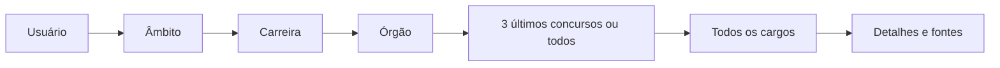
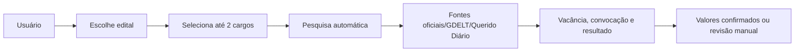
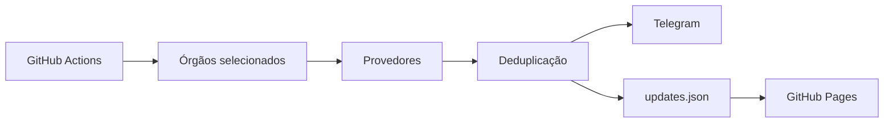

# Arquitetura e DFD

## Componentes

- **Colab:** interface administrativa e pesquisa pontual.
- **JSON:** armazenamento versionado.
- **Python:** regras, importação de PDF, pesquisa, validação e alertas.
- **GitHub Actions:** CI/CD e pesquisa agendada.
- **GitHub Pages:** portal estático.
- **Telegram:** notificações.

## DFD — consulta histórica

## DFD — edital aberto

## DFD — alertas

## Decisão de segurança

A pesquisa automática não inventa valores. Se localizar documentos, mas não conseguir extrair métricas de forma confiável, retorna `MANUAL_REVIEW_REQUIRED` e preserva os links.
