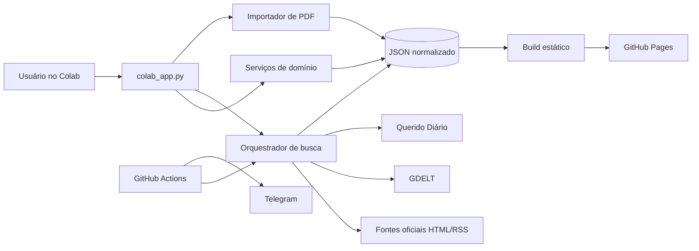
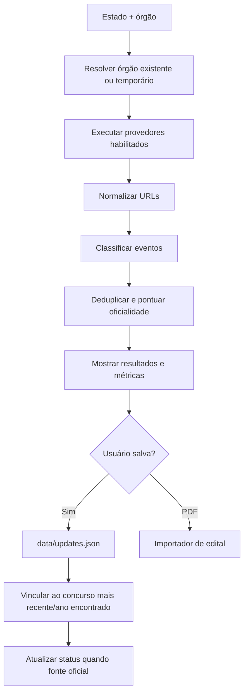
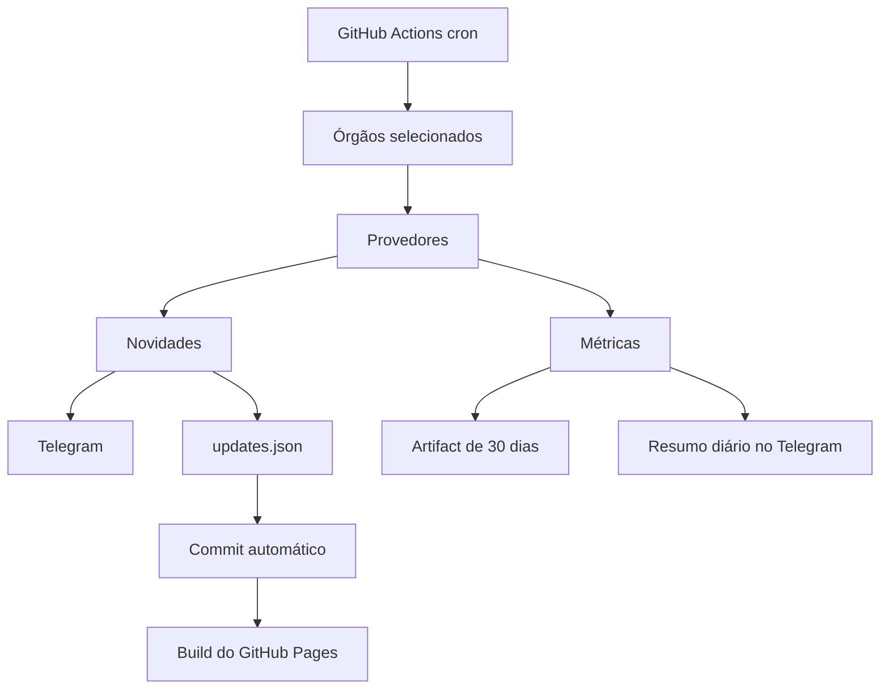

# Arquitetura e DFD

## Componentes

## Busca manual por órgão

## Automação

## Regra de segurança dos dados

A busca automática não inventa vacância, nota ou último chamado. Ela registra publicações e pode atualizar o status geral do concurso quando a URL é oficial. Vacância e histórico de chamadas exigem fonte específica ligada ao cargo.
