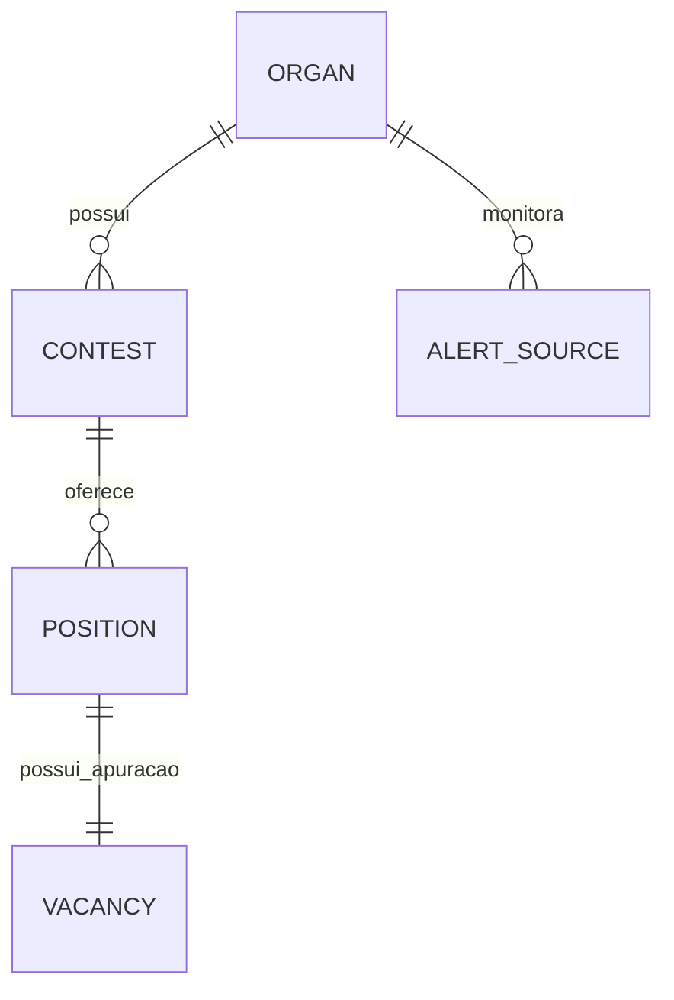
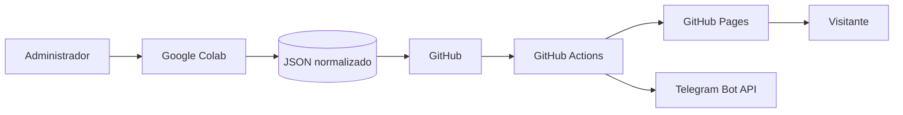
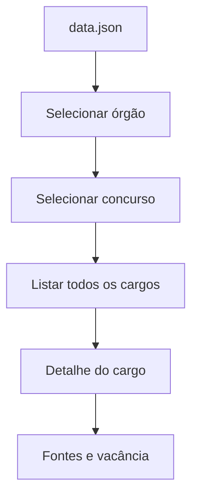
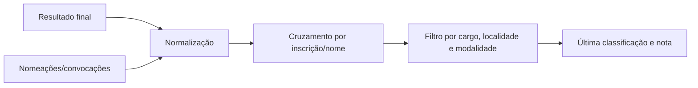

# Arquitetura e DFD

## Decisões

- **HTML/CSS/JavaScript puro:** pequeno, sem build front-end e compatível com GitHub Pages.
- **Python:** valida dados, gera o portal e executa monitoramentos no Colab e Actions, sem dependências externas.
- **JSON normalizado:** três arquivos evitam repetir órgão e concurso em cada cargo.
- **GitHub Actions:** CI/CD gratuito; nenhum servidor fica ligado permanentemente.

## Modelo

## DFD nível 0

## DFD do portal

## DFD de último chamado

